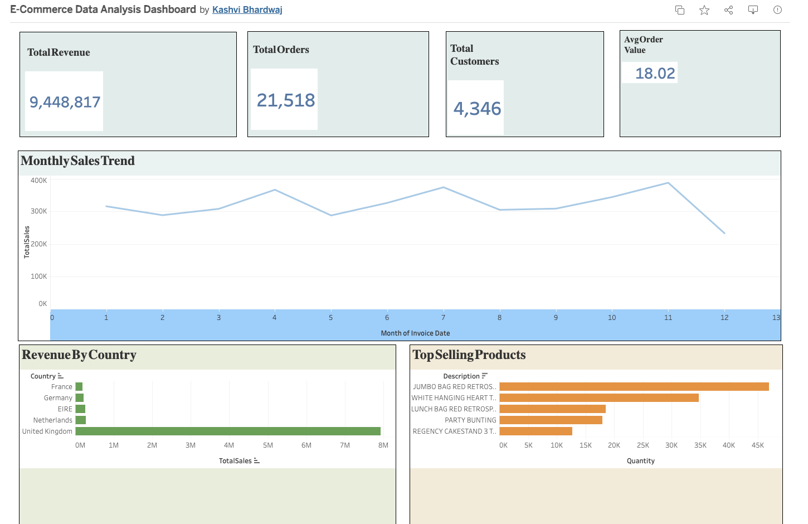

# E-Commerce Data Analysis Dashboard

## Project Overview

This project focuses on analyzing e-commerce retail transaction data using SQL, Python, and Tableau. The goal of the project is to extract business insights related to sales performance, customer behavior, top-selling products, and country-wise revenue trends.

The project includes:
- SQL-based data analysis
- Python exploratory data analysis (EDA)
- Interactive Tableau dashboard
- Business insights and visualizations

---

## Live Tableau Dashboard

[View Tableau Dashboard](https://public.tableau.com/app/profile/kashvi.bhardwaj6482/viz/E-CommerceDataAnalysisDashboard/E-CommerceSalesDashboard?publish=yes)

---

## Dataset

The dataset contains online retail transactions with fields such as:
- Invoice Number
- Product Description
- Quantity
- Unit Price
- Customer ID
- Country
- Invoice Date

Dataset Size:
- 500K+ retail transaction records

---

## Tools & Technologies Used

- MySQL Workbench
- Python
- Pandas
- Matplotlib
- Tableau Public
- GitHub

---

## Project Structure

```text
Ecommerce-Data-Analysis/
│
├── data/
│   ├── data.csv
│   └── cleaned_data.csv
│
├── sql/
│   ├── schema.sql
│   ├── queries.sql
│   └── advanced_queries.sql
│
├── notebooks/
│   └── analysis.ipynb
│
├── dashboard/
│   ├── ecommerce_dashboard.twbx
│   ├── dashboard_preview.png
│   ├── monthly_sales.png
│   ├── top_products.png
│   └── country_revenue.png
│
└── README.md
```

---

## SQL Analysis Performed

The SQL analysis includes:
- Total revenue calculation
- Country-wise revenue analysis
- Top-selling products
- Customer order analysis
- Revenue aggregation
- Advanced joins and filtering queries

---

## Python Analysis

Using Python and Pandas:
- Data cleaning
- Missing value analysis
- Revenue calculations
- Exploratory data analysis
- Customer analysis
- Product analysis
- Monthly sales trend analysis

Visualizations were created using Matplotlib.

---

## Tableau Dashboard Features

The interactive Tableau dashboard includes:
- Total Revenue KPI
- Total Orders KPI
- Total Customers KPI
- Average Order Value KPI
- Monthly Sales Trend
- Revenue by Country
- Top Selling Products

---

## Key Insights

- United Kingdom generated the highest revenue among all countries.
- Sales showed strong growth trends during peak months.
- A small number of products contributed significantly to overall sales.
- Repeat customers played an important role in revenue generation.
- Monthly sales patterns helped identify high-performing periods.

---

## Dashboard Preview





---

## Skills Demonstrated

- SQL Querying
- Data Cleaning
- Exploratory Data Analysis
- Data Visualization
- Dashboard Design
- Business Intelligence
- Tableau Dashboarding
- Git & GitHub

---

## Future Improvements

Possible future enhancements:
- Customer segmentation
- Sales forecasting
- Streamlit web application
- Machine learning-based recommendations
- Power BI dashboard version

---

## Author

Kashvi Bhardwaj

### Tableau Dashboard
https://public.tableau.com/app/profile/kashvi.bhardwaj6482/viz/E-CommerceDataAnalysisDashboard/E-CommerceSalesDashboard?publish=yes
